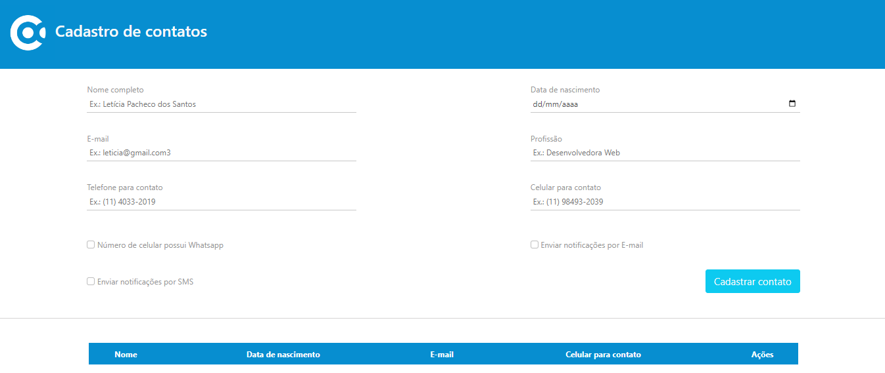

# Alphacode



---

## Sobre

Este projeto tem como objetivo realizar um CRUD para um teste da empresa Alphacode utilizando a linguagem PHP.

---

## Tecnologias utilizadas

- PHP
- HTML
- CSS
- JavaScript
- JQuery 
- MySQL
- Bootstrap
- XAMPP
- Postman
- Composer

---

## Banco de dados

Utilizei o banco de dados MySQL para toda a realização das tabelas e relacionamentos dos dados da aplicação, segue abaixo o script utilizado:

```sql

create database db_alphacode;

use db_alphacode;

create table tbl_usuario (
       id int not null auto_increment primary key,
       nome varchar(130) not null,
       data_nascimento date not null,
       email varchar(255) not null,
       profissao varchar(90) not null,
       telefone varchar(20) not null,
       celular varchar(20) not null,
       numero_whatsapp boolean not null,
       notificacao_email boolean not null,
       notificacao_sms boolean not null

       unique index (id)
);

```

---

## Como rodar a aplicação

- 1º Baixe o PHP, XAMPP e o Composer.
- 2º Após baixá-los, realizar a configuração de cada um.
- 3º Logo após ter configurado o XAMPP, abra o seu explorador de arquivos e procure pelo diretório 'xampp'. Em seguida, siga este caminho: xampp > htdocs e cole o clone deste projeto nessa pasta.
- 4º Abra o projeto no seu editor de texto ou editor de código e siga esse caminho: backend > src > model > conexao.php e mude o valor das variáveis abaixo de acordo com seu banco de dados.

```javascript

const SERVER = 'localhost';
const USER = 'root';
const PASSWORD = '12345';
const DATABASE = 'db_alphacode';

```

- 5º Abra o XAMPP e inicie o Apache.
- 6º Volte para a pasta deste projeto e siga o seguinte caminho: frontend > e inicie o index.html com o Live Server.

---

## Autor
- [Matheus Alves Reis da Silva](https://github.com/MatheusAlves099)